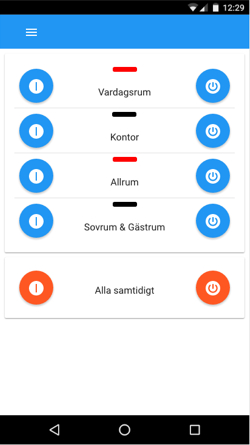
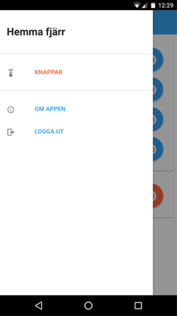

# HA Remote
> A simplified GUI for Home Assistant and Telldus Live making is possible to choose a subset of devices managed by a
HomeAssistant installation and/or Telldus Live and make them visible in a separate GUI.

The main idea behind the project has been to make it easier to "sell" home automation to not to technical family members. 
This is supposed to be achieved by mimicing physical controls but still making them available in a mobile device. The web
GUI is built using reposnsive design making it work booth in a smart phone as well as in a desktop browser.
The app supports being placed on the home screen (iOS & Android) and will in that case behave almost like a native app.

# Screenshots

# Installation and configuration

## Installation

Clone the repo to a location on your machine, from the root directory of the repo issue the following commands:

You will have to have the `grunt-cli` module installed globally, if you don't start with:
	
	$ npm install -g grunt-cli

Then run the following commands to install and build the app:

	$ cd client
	$ bower install
	$ npm install
	$ grunt build
	$ cd ../server
	$ npm install --production

## Device Configuration

Devices that should be possible to switch on and off from the application has to be listed in a json file, by default
the file is located in the directory where the server is started and is named `configuration.json`. Name and location of
the file can be changed before starting the server - see *Server Runtime Configuration*.

### Controls

A sample configuration file:
 
    {
      "groups": [
        {
          "caption": "Main Group",
          "enableSwitchAll": false,
          "controls": [
            {
              "backend": "ha"
              "caption": "Vardagsrum",
              "device_id": "group.vardagsrum",
              "service": {
                "domain": "switch",
                "onService": "turn_on",
                "offService": "turn_off"
              }
            },
            {
              "backend": "telldus",
              "caption": "Garagebänk",
              "device_id": "1268183"
            },
          ]
        }
      ]
    }

On the top level there is a array of control `groups`, all devices are expected to belong to a group. A group has the
following properties:

* `caption` Mandatory sting that use used to refer to the group in the GUI.
* `enableSwitchAll` Optional boolean that controls if the group should be possible to swicth on or off togheter. If not
set it will default to true.
* `controls` Manadory array of controls to be part of the group.

The objects in the `controls` array represents devices that can me managed, the controls have the following properties:

* `"backend"` is one of two values depending on if the device is managed by home assistant (`ha`) or Telldus Live
(`telldus`)
* `"caption"` is the name of the device that will be visible in the application GUI.
* `"device_id"` is the id of the device in the Home Assistant/Telldus Live system that manages the device.

The `"service"` object, only relevant for a Home Assitant devices, defines how the device can be switched on and off
trough the Home Assistant REST API Endpoint `/api/services` please refer to the 
[Home Assistant API documentation](https://home-assistant.io/developers/rest_api/#post-apiservicesltdomainltservice).

The repo contains a sample configuration file at `server/src/configuration.json`.

## Server Runtime Configuration
The application is configured trough a number of environment variables that can be set before the server is started.

| Variable | Default Value | Comment |
|:---------|:--------------|:--------|
|`LOGLEVEL`|`info`|Granulairity of server side log messages, has to be one of `debug`, `info`, `warn` or `error`.|
|`PORT`| `8080`|HTTP Ports the server will listen on|
|`SSL`|`YES`|Decides if the server it to be running HTTPS, any other value than `YES` will disable TLS and serve using plain text HTTP.
|`CONFIGFILE`|`./src/configuration.json`|The file in where to read information about the controls to render to the user and how to associate them to devices in Home Assistant.|
|`PASSWORD`|Empty string|The password users has to supply in the web GUI to login to the application.|
|`TOKEN_SALT`|None - has to be set, if not the server will not start.|A salt used to generate the authentication token as part of the login and authorization. Any random string will do, the longer the better. Can for example be generated using openssl: `$ openssl rand -base64 64`|
|`HA_SERVER`|`http://localhost:8123`|Remote Home Assistant instance to delegate controll commands to. Only used of any of the controlled devices is managed trough a Home Assistant installation.|
|`HA_PASSWORD`|Empty string|Password to use to authenticate to the Home Assistance instance. Only used of any of the controlled devices is managed trough a Home Assistant installation.|
|`TELLDUS_PUBLIC_KEY`|Undefined|Telldus public key |
|`TELLDUS_PRIVATE_KEY`|Undefined|Telldus private key.|
|`TELLDUS_TOKEN`|Undefined|Telldus user token.|
|`TELLDUS_TOKEN_SECRET`|Undefined|Telldus user token secret.|

### Telldus API keys
To be able to integrate with telldus live you will have to supply four different values in the enviroment, the API keys
and user tokens can be generated on the [Telldus Live API website](http://api.telldus.com/keys/index).

## SSL/TLS

The repo contains a set of SSL files that is self signed. To use another certificate replace the files in `server/src/sll`.

# Starting the server

In the `server` directory of the repo run the comand `$ npm start`. This will start the server and start logging to
`STDOUT`. *(Please note that the server will not start if it does not find the environment varaible `TOKEN_SALT`)*.

# Running the app

If no changes to the default runtime configuration has been made the application is now being served on port 8080 of
the host where it was started. Point your browser to `https://localhost:8080' (asuming you run it locally). If you are
running with the supplied SSL certificate you will have to accept them as untrusted in your browser. You should now be
presented with the login screen. If no password has been set, the application will accept an empty password for login.

# Development

## API Simulator

The API simulator `ha-sim` simulates the parts of the Home Assistant REST API used by the application. It can be used as
a replacement for a real home assistnt installation during development and testing.

## API Simulator Configuration
The application is configured trough a number of environment variables that can be set before the server is started.

| Variable | Default Value | Comment |
|:---------|:--------------|:--------|
|`LOGLEVEL`|`info`|Granulairity of simulator log messages, has to be one of `debug`, `info`, `warn` or `error`.|
|`PORT`| 8081|HTTP Ports the API simlator will listen on|
|`REQUESTDELAY`|`0`|Sets a delay, in miliseconds, that will be applied to all requests to the API before the response is returned. Allows simualation of real world timings of interaction with the API.|
|`STATEDELAY`|`0`|Set's the dely, in miliseconds, between a call to the `/services*` API and the actual change of the entity state. This makes it possible to simulate the fact that the state is not always immediately updated in the Home Assistant system.|

## Starting the Simulator

<del>In root of the repository issue `$ npm start ha-sim`. It will start the simulation server in a separate process and
start logging it's activity to `STDOUT`.</del>

## TODO

**TODO:** It would be neat to be able to add and remove devices from the GUI.

**TODO:** Merge client and server code into one common structure and package.

**TODO:** Security - even if the current solution probably is good enough for this kind of app it could be improved and
would need a second pair of eyes (that know that kind of stuff) to have a look.

## Contact
Questions, comments, suggestions: jonas.m.andreasson(a)gmail.com.

Development: Send a pull request on github
[https://github.com/crusaider/ha-remote](https://github.com/crusaider/ha-remote)

# License

## The MIT License (MIT)

Copyright (c) 2016 Jonas Andreasson

Permission is hereby granted, free of charge, to any person obtaining a copy of this software and associated
documentation files (the "Software"), to deal in the Software without restriction, including without limitation the
rights to use, copy, modify, merge, publish, distribute, sublicense, and/or sell copies of the Software, and to permit
persons to whom the Software is furnished to do so, subject to the following conditions:

The above copyright notice and this permission notice shall be included in all copies or substantial portions of the
Software.

THE SOFTWARE IS PROVIDED "AS IS", WITHOUT WARRANTY OF ANY KIND, EXPRESS OR IMPLIED, INCLUDING BUT NOT LIMITED TO THE
WARRANTIES OF MERCHANTABILITY, FITNESS FOR A PARTICULAR PURPOSE AND NONINFRINGEMENT. IN NO EVENT SHALL THE AUTHORS OR
COPYRIGHT HOLDERS BE LIABLE FOR ANY CLAIM, DAMAGES OR OTHER LIABILITY, WHETHER IN AN ACTION OF CONTRACT, TORT OR
OTHERWISE, ARISING FROM, OUT OF OR IN CONNECTION WITH THE SOFTWARE OR THE USE OR OTHER DEALINGS IN THE SOFTWARE.
